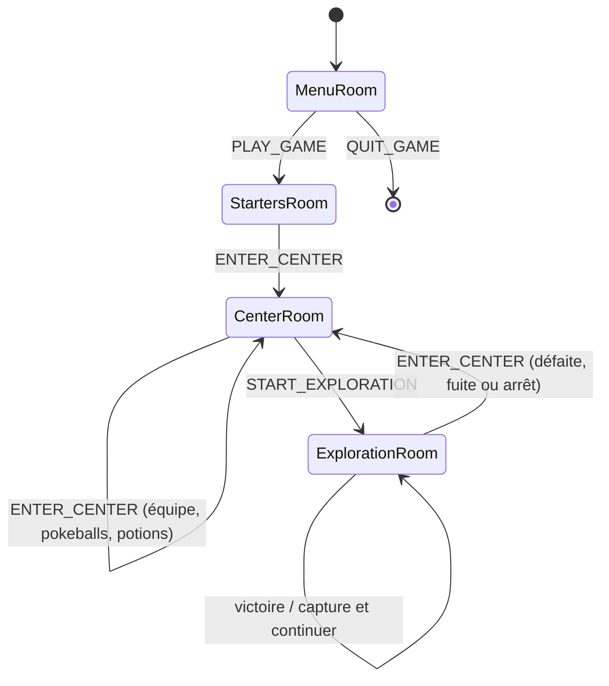
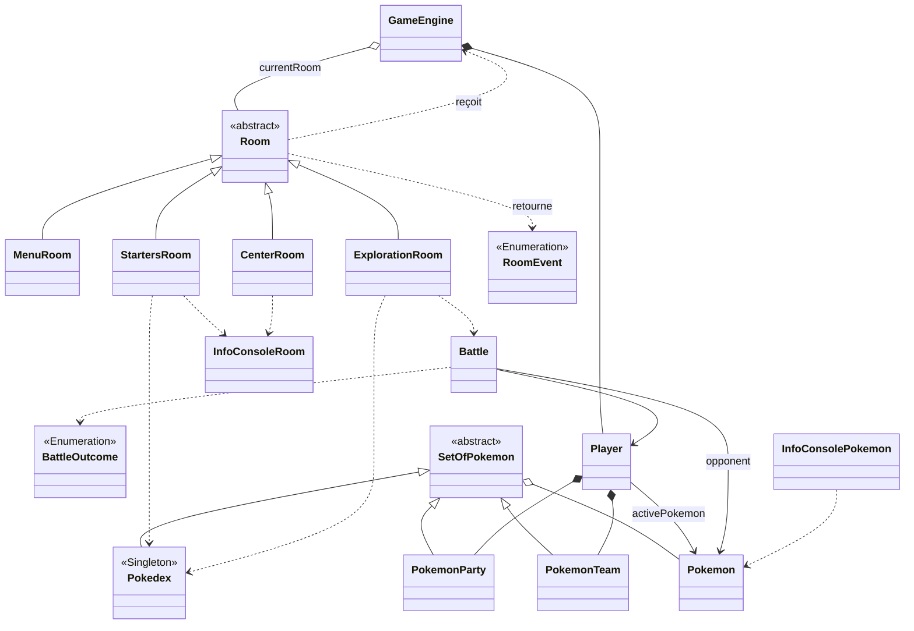

# introduction_c++_pokemon

Pour jouer au jeu, il faut écrire dans la console le nom du pokemon que le joueur choisit, puis le nom du pokemon de son adversaire.
Ensuite les pokemons commencent à s'attaquer chacun leur tour jusqu'à ce qu'un des deux meure.

## Avancée du jeu
Je n'ai pas utilisé le framework SFML, le jeu se fait uniquement sur console.
Lorsque le code est compilé, le joueur se trouve sur le menu. Il peut choisir de joueur ou de quitter le jeu.
S'il décide de jouer, il doit choisir 4 starters parmi 12 starters proposés.
Ces starters sont envoyés dans sa party.

Une fois les quatre starters choisis, le joueur se trouve dans la CenterRoom. Lorsque le joueur arrive dans la pièce, les pokemon de son équipe sont soignés. 
Il a alors 4 choix d'action possible – Voir son équipe de pokemon et la modifier à partir de sa pokemon party. Une fois que le joueur à terminer, il se retrouve sur la page de CenterRoom.
    
- Récupérer des pokeball.
- Récupérer des potions de soins.
- Commencer le mode exploration.

En mode exploration, un adversaire est choisit aléatoirement et un combat commence.
Le combat se déroule de la manière suivante :
- Le joueur choisit de sélectionner un pokemon actif qui va combattre l'adversaire.
- Il y a ensuite 5 actions possibles : 
    * Attaquer l'adversaire : l'adversaire esquive l'attaque si sa défense est supérieure à l'attaque du pokemon actif, il subit des dégats sinon.
    * Utiliser une pokeball : qui capture le pokemon si l'adversaire a moins de 20PV. Un pokemon capturé est ajouté à la pokemon Party.
    * Utiliser une potion de soin : soigne 20PV du pokemon actif.
    * Changer de pokemon actif : en le remplacant par un autre pokemon de l'équipe qui est en vie.
    * Fuir le combat : on retourne alors dans la CenterRoom.
- Le pokemon attaque ensuite le pokemon actif. Si Aucun des deux pokemons n'est mort, le joueur choisit encore de faire une action.
- Le joueur perd si tous les pokemons de son equipe sont mort. Il retourne alors dans la CenterRoom.
- Le joueur gagne lorsqu'il capture le pokemon ou le tue. Il a alors le choix de continuer le mode exploration ou de retourner dans la CenterRoom.

L'ensemble du jeu est fonctionnel. Mais il reste toujours des points à vérifier

## Graphe d'état :
## Diagramme d'état

## Fonctionnalités du code 
- Usage de polymorphisme avec l'héritage des classes `SetOfPokemon` et `Room` qui définissent des méthodes qui sont implémentée de manières différentes dans les classes qui héritent.
- Usage d'iterateur dans les boucles for de la méthode `getPokemonByName(string name)` de la classe Pokedex pour parcour tous les pokemons du pokedex.
- Usage de vecteurs notamment dans la classe SetOfPokemon qui définit un tableau de pokemons.
- Usage de type auto dans la méthode `Battle::isTheBattleGoingToEnd()` de la classe `Battle`.
- Traitements d'exceptions lors des saisies de l'utilisater comme dans la méthode `CenterRoom::selectPokemonToAdd(GameEngine &engine)` qui récupère le pokemon de la party qui a l'indice saisi par l'utilisateur avec un try and catch.
- Usage d'un design pattern state pour gérer les transitions entre les différents état du jeu (menu/ choix des starters / centre pokemon / exploration)

## Diagramme de classe

